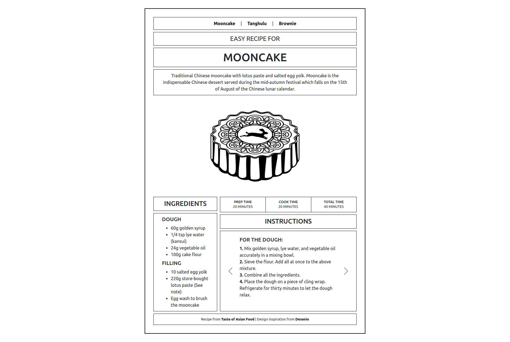
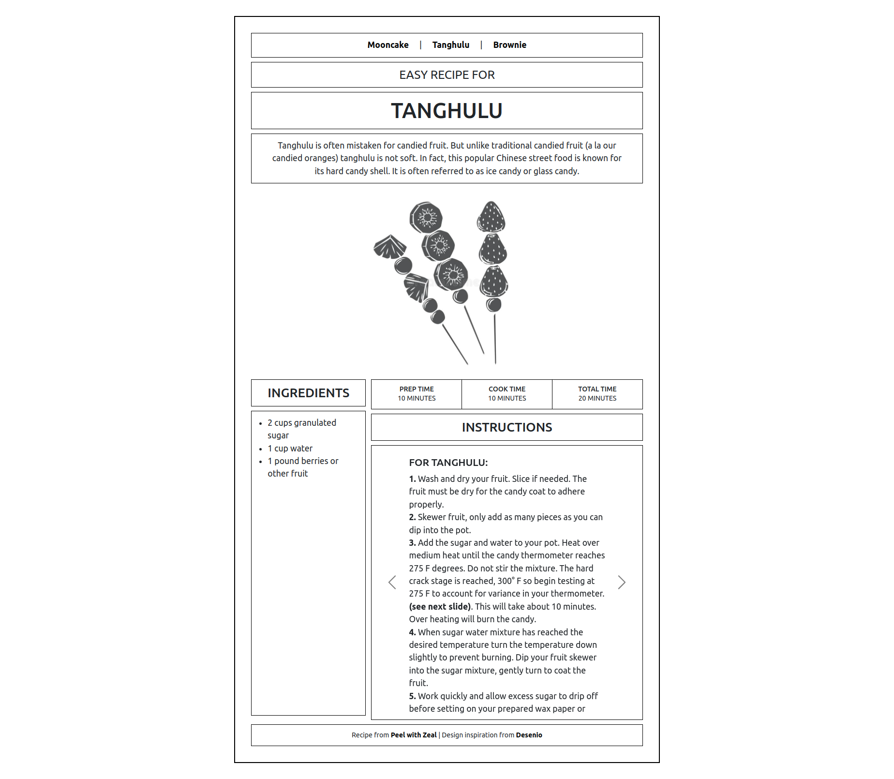
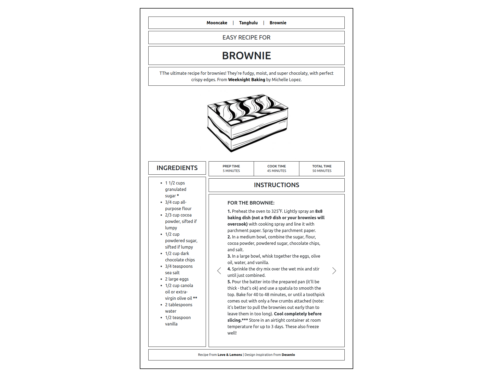

# Odin Recipe Project

## About 
My entry for Odin Recipe Project consists of recipes for some of my favorite sweet treats - mooncake, tanghulu and brownie. 

## Screenshots

## References

- Design Template Inspiration: https://desenio.com/us/posters-prints/typography-and-quotes/pancake-recipe-poster
- Brownie Illustration: https://st4.depositphotos.com/6526918/24942/v/380/…tion-slice-of-cake-is-isolated.jpg?forcejpeg=true
- Brownie Recipe: https://www.loveandlemons.com/brownies-recipe/
- Mooncake Illustration: https://thumbs.dreamstime.com/b/delicious-mooncake…ometric-cartoon-vector-illustration-155954739.jpg
- Mooncake Recipe: https://tasteasianfood.com/mooncake-recipe/
- Tanghulu Illustration: https://thumbs.dreamstime.com/b/tanghulu-glyph-mon…k-asian-traditional-sweets-engraved-217960558.jpg
- Tanghulu Recipe: https://www.peelwithzeal.com/tanghulu/
